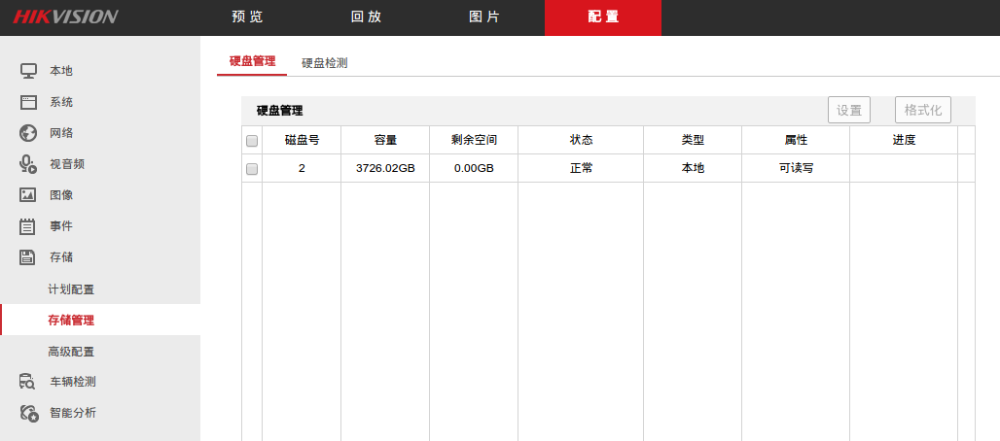
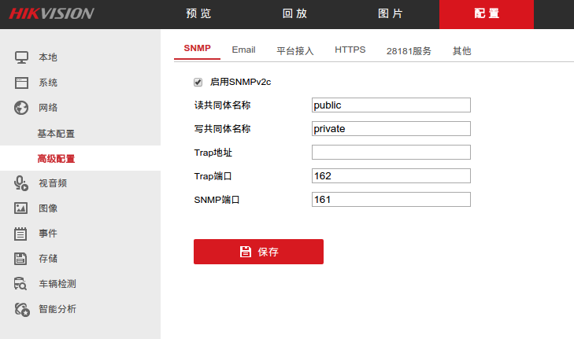
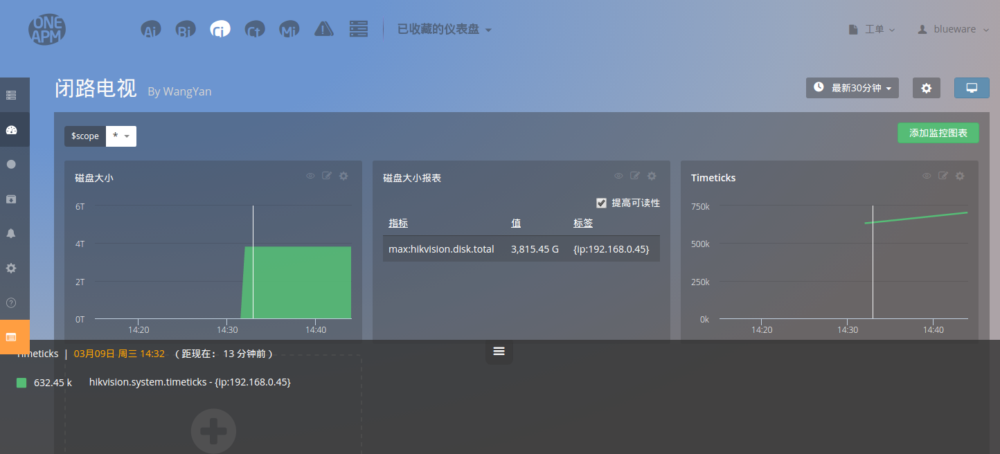

# monitor-harddisk
> 使用 CloudInsight 监控闭路电视系统的磁盘大小

## 操作步骤

### 1\.配置闭路电视系统

查看 **磁盘信息**


打开 闭路电视系统的 ** SNMP 功能**


### 2\.运行监控脚本

```
git clone git@github.com:wyvernnot/monitor-harddisk.git
cd monitor-harddisk
npm install
node index.js
```

### 3\.登录 CloudInsight 配置仪表盘

**新建仪表盘**

**查看数据**


